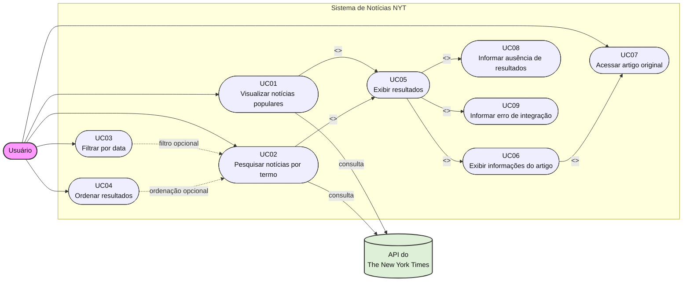
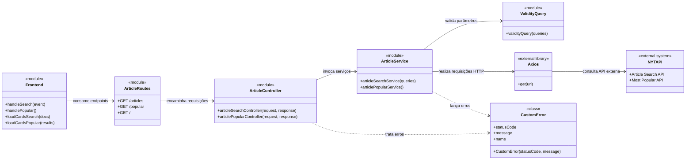
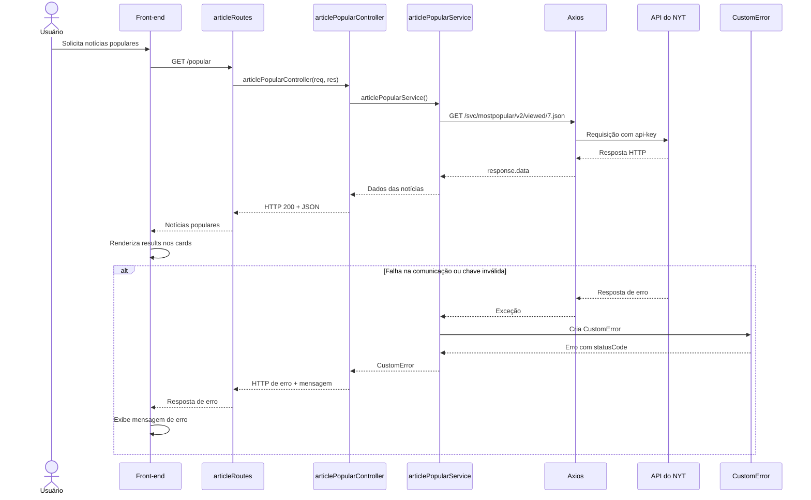
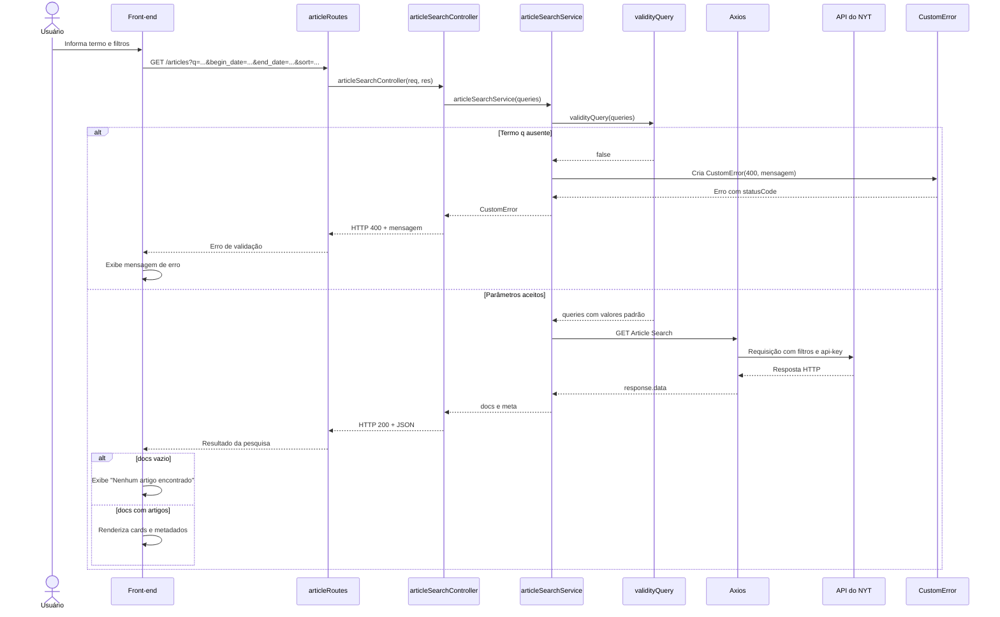

# Diagrama de Casos de Uso

```mermaid
flowchart LR
    Usuario([Usuário])
    NYT[(API do<br/>The New York Times)]

    subgraph Sistema["Sistema de Notícias NYT"]
        UC01([UC01<br/>Visualizar notícias populares])
        UC02([UC02<br/>Pesquisar notícias por termo])
        UC03([UC03<br/>Filtrar por data])
        UC04([UC04<br/>Ordenar resultados])
        UC05([UC05<br/>Exibir resultados])
        UC06([UC06<br/>Exibir informações do artigo])
        UC07([UC07<br/>Acessar artigo original])
        UC08([UC08<br/>Informar ausência de resultados])
        UC09([UC09<br/>Informar erro de integração])
    end

    Usuario --> UC01
    Usuario --> UC02
    Usuario --> UC03
    Usuario --> UC04
    Usuario --> UC07

    UC01 -->|"<<include>>"| UC05
    UC02 -->|"<<include>>"| UC05
    UC05 -->|"<<include>>"| UC06
    UC05 -->|"<<extend>>"| UC08
    UC05 -->|"<<extend>>"| UC09
    UC06 -->|"<<extend>>"| UC07

    UC01 -->|consulta| NYT
    UC02 -->|consulta| NYT

    UC03 -.->|filtro opcional| UC02
    UC04 -.->|ordenação opcional| UC02

    classDef actor fill:#f9f,stroke:#333,stroke-width:2px,color:#111;
    classDef external fill:#dff0d8,stroke:#333,stroke-width:2px,color:#111;
    classDef usecase fill:#eef,stroke:#333,stroke-width:1px,color:#111;

    class Usuario actor;
    class NYT external;
    class UC01,UC02,UC03,UC04,UC05,UC06,UC07,UC08,UC09 usecase;
```

# Diagrama de Classes e Módulos

```mermaid
classDiagram
    direction LR

    class ArticleRoutes {
        <<module>>
        +GET /articles
        +GET /popular
        +GET /
    }

    class ArticleController {
        <<module>>
        +articleSearchController(request, response)
        +articlePopularController(request, response)
    }

    class ArticleService {
        <<module>>
        +articleSearchService(queries)
        +articlePopularService()
    }

    class ValidityQuery {
        <<module>>
        +validityQuery(queries)
    }

    class CustomError {
        <<class>>
        +statusCode
        +message
        +name
        +CustomError(statusCode, message)
    }

    class Axios {
        <<external library>>
        +get(url)
    }

    class NYTAPI {
        <<external system>>
        +Article Search API
        +Most Popular API
    }

    class Frontend {
        <<module>>
        +handleSearch(event)
        +handlePopular()
        +loadCardsSearch(docs)
        +loadCardsPopular(results)
    }

    ArticleRoutes --> ArticleController : encaminha requisições
    ArticleController --> ArticleService : invoca serviços
    ArticleService --> ValidityQuery : valida parâmetros
    ArticleService --> Axios : realiza requisições HTTP
    Axios --> NYTAPI : consulta API externa
    ArticleService ..> CustomError : lança erros
    ArticleController ..> CustomError : trata erros
    Frontend --> ArticleRoutes : consome endpoints
```

# Diagrama de Sequência — Notícias Populares

```mermaid
sequenceDiagram
    actor Usuario as Usuário
    participant Front as Front-end
    participant Route as articleRoutes
    participant Controller as articlePopularController
    participant Service as articlePopularService
    participant Axios as Axios
    participant NYT as API do NYT
    participant Error as CustomError

    Usuario->>Front: Solicita notícias populares
    Front->>Route: GET /popular
    Route->>Controller: articlePopularController(req, res)
    Controller->>Service: articlePopularService()

    Service->>Axios: GET /svc/mostpopular/v2/viewed/7.json
    Axios->>NYT: Requisição com api-key
    NYT-->>Axios: Resposta HTTP
    Axios-->>Service: response.data

    Service-->>Controller: Dados das notícias
    Controller-->>Route: HTTP 200 + JSON
    Route-->>Front: Notícias populares
    Front->>Front: Renderiza results nos cards

    alt Falha na comunicação ou chave inválida
        NYT-->>Axios: Resposta de erro
        Axios-->>Service: Exceção
        Service->>Error: Cria CustomError
        Error-->>Service: Erro com statusCode
        Service-->>Controller: CustomError
        Controller-->>Route: HTTP de erro + mensagem
        Route-->>Front: Resposta de erro
        Front->>Front: Exibe mensagem de erro
    end
```

# Diagrama de Sequência — Pesquisa de Artigos

```mermaid
sequenceDiagram
    actor Usuario as Usuário
    participant Front as Front-end
    participant Route as articleRoutes
    participant Controller as articleSearchController
    participant Service as articleSearchService
    participant Validation as validityQuery
    participant Axios as Axios
    participant NYT as API do NYT
    participant Error as CustomError

    Usuario->>Front: Informa termo e filtros
    Front->>Route: GET /articles?q=...&begin_date=...&end_date=...&sort=...
    Route->>Controller: articleSearchController(req, res)

    Controller->>Service: articleSearchService(queries)
    Service->>Validation: validityQuery(queries)

    alt Termo q ausente
        Validation-->>Service: false
        Service->>Error: Cria CustomError(400, mensagem)
        Error-->>Service: Erro com statusCode
        Service-->>Controller: CustomError
        Controller-->>Route: HTTP 400 + mensagem
        Route-->>Front: Erro de validação
        Front->>Front: Exibe mensagem de erro
    else Parâmetros aceitos
        Validation-->>Service: queries com valores padrão

        Service->>Axios: GET Article Search
        Axios->>NYT: Requisição com filtros e api-key
        NYT-->>Axios: Resposta HTTP
        Axios-->>Service: response.data

        Service-->>Controller: docs e meta
        Controller-->>Route: HTTP 200 + JSON
        Route-->>Front: Resultado da pesquisa

        alt docs vazio
            Front->>Front: Exibe "Nenhum artigo encontrado"
        else docs com artigos
            Front->>Front: Renderiza cards e metadados
        end
    end
```
